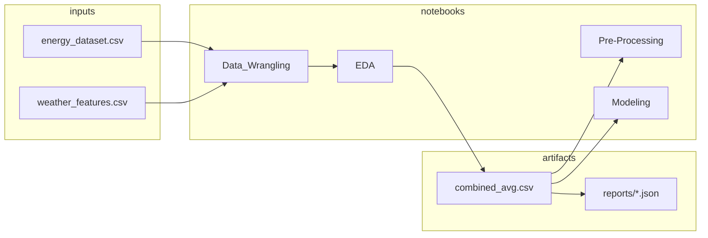
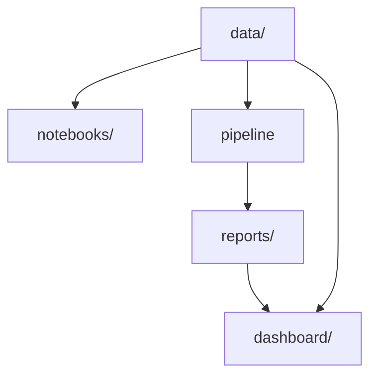

# Spain hourly electricity — demand forecasting project

## Data (`data/combined_avg.csv`)

Figures below match `reports/dataset_summary.json` produced by `python3 -m pipeline` (regenerate after changing the CSV).

| Quantity | Value |
|----------|--------|
| Rows | 35,064 |
| Time index (UTC) | 2014-12-31 23:00 → 2018-12-31 22:00 |
| Columns (excluding `time` index) | 27 |
| `total load actual` mean | 28,698.3 MW |
| `total load actual` std | 4,575.8 MW |
| `total load actual` min | 18,041 MW |
| `total load actual` max | 41,015 MW |

Column names: generation by fuel/technology (e.g. biomass, fossil gas, solar, wind onshore), day-ahead forecasts for solar/wind and total load, `total load actual`, day-ahead and actual price, and averaged weather (`temp`, `pressure`, `humidity`, `wind_speed`, `rain_1h`, `snow_3h`, `clouds_all`). Full list is in `reports/dataset_summary.json`.

Raw inputs in `data/` are `energy_dataset.csv` and `weather_features.csv` from the Kaggle dataset linked below. Derived files (`energy_data.csv`, `weather_wide.csv`, `weather_avg.csv`, `combined_avg.csv`) are written by the notebooks in `notebooks/`.

## Pipeline metrics (`reports/model_metrics.json`)

The CLI fits two sklearn models on **numeric columns only** (targets and price columns dropped), **forward-filled / back-filled** missing values in features, **chronological split**: last **15%** of rows as test.

| Model (name in JSON) | Test rows | Features | RMSE (MW) | MAE (MW) |
|----------------------|-----------|----------|-----------|----------|
| `linear_regression` | 5,260 | 23 | 1,380.48 | 1,099.14 |
| `random_forest_quick` (`n_estimators=80`, `max_depth=12`, `random_state=42`, `n_jobs=-1`) | 5,260 | 23 | 1,726.40 | 1,352.00 |

The same JSON file includes entries with `rmse_mw: null` for models that are only trained inside `notebooks/Modeling.ipynb` (not re-run by the CLI).

## Data quality snapshot (`reports/data_quality.json`)

| Check | Value |
|-------|--------|
| Duplicate index rows | 0 |

The report also lists missing percentage by column (top columns by missing share); the current export shows 0% for listed fields.

## Repository structure

```
data/                 # CSV inputs and notebook outputs
notebooks/            # Data_Wrangling → EDA → Pre-Processing → Modeling
energy_forecast/      # `DATA` path + `save_file` (editable install)
pipeline/             # `python -m pipeline`
reports/              # JSON from the pipeline
dashboard/            # `streamlit run dashboard/app.py`
.streamlit/           # Streamlit config
pyproject.toml        # `pip install -e .` for `energy_forecast`
requirements.txt
Makefile
```

## Flow





## Setup

```bash
python3 -m venv .venv
source .venv/bin/activate   # Windows: .venv\Scripts\activate
pip install -U pip
pip install -r requirements.txt
pip install -e .
```

`pip install -e .` is required so notebooks can `from energy_forecast.notebook_setup import DATA`.

## Commands (repo root)

1. Run Jupyter notebooks in `notebooks/` in filename order: `Data_Wrangling` → `Exploratory_Data_Analysis` → `Pre-Processing` → `Modeling`.
2. `python3 -m pipeline` — writes `reports/dataset_summary.json`, `data_quality.json`, `rolling_load.json`, `model_metrics.json` (unless `--skip-models`, which skips the sklearn fits only).
3. `streamlit run dashboard/app.py` — reads `data/combined_avg.csv` and `reports/*.json`.

`Makefile`: `make install`, `make pipeline`, `make dashboard` (uses `.venv`).

## Source dataset

[Kaggle: Energy consumption, generation, prices and weather](https://www.kaggle.com/datasets/nicholasjhana/energy-consumption-generation-prices-and-weather) — Spain; terms are those of Kaggle and the upstream data providers.

## Notebooks in Git

Notebook outputs are cleared in version control; execute cells locally after clone if you need inline results.
